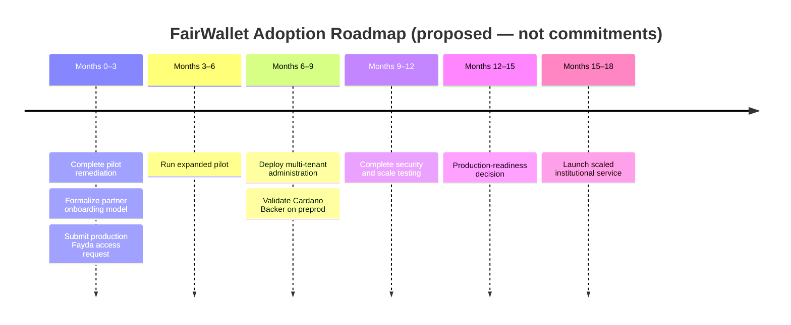

# Adoption Roadmap

**Acceptance criterion 4 (part):** Develop an adoption roadmap.

> **Status:** 🟡 **Provided — awaiting review.** 🔭 **All milestones below are proposed future
> work** — targets and timeframes, not commitments or current capability. Production Fayda
> access is **not** granted; Cardano backing is **not** enabled and remains **conditional** on
> successful preprod testing, cost assessment, security review and legal approval.

## Roadmap milestones (proposed)

| # | Milestone | Target outcome | Timeframe | Key dependencies |
|---|-----------|----------------|-----------|------------------|
| 1 | Complete pilot remediation | The three evidence-based improvement areas implemented and retested | Months 0–2 | Feedback; updated onboarding materials; verification test plan |
| 2 | Formalize partner onboarding model | Standard agreements, roles, data responsibilities, training & support procedures | Months 0–3 | Lessons from IE Networks & Jasper Ethiopia; legal/privacy review; responsibility matrix |
| 3 | Submit production Fayda access request | Production requirements, security controls & access conditions understood and formally requested | Months 0–3 | National ID Ethiopia requirements; security & data-flow documentation |
| 4 | Run expanded pilot | 100–500 participants across 3–5 institutions with measured completion & satisfaction | Months 3–6 | Pilot remediation; partner agreements; staff training; stable infrastructure |
| 5 | Deploy multi-tenant administration | Institutions operate separate issuer/verifier accounts with role-based controls | Months 6–9 | Access-control design; schema governance; audit logging; production key management |
| 6 | Validate Cardano Backer on preprod | KERI log backing demonstrated with documented transactions, performance, cost & verification value | Months 6–9 | Cardano Backer deployment; Cardano **preprod** infrastructure; test plan; monitoring |
| 7 | Complete security & scale testing | Load, recovery, privacy & security tests demonstrate multi-institution readiness | Months 9–12 | Multi-tenant deployment; monitoring; backup & recovery controls |
| 8 | Production-readiness decision | Fairway & institutions approve production operating, governance & support model | Months 12–15 | Fayda production access; security review; expanded-pilot results; Cardano Backer evaluation |
| 9 | Launch scaled institutional service | At least 5,000 holders supported under documented service & governance arrangements | Months 15–18 | Production approvals; sustainable operating model; institutional integrations; support capacity |

## Timeline (proposed)

> The Cardano-related milestone (6) and any production Cardano decision (8) are gated on
> preprod evidence, cost, security and legal review — see the conditions at the top of this
> page and in the [scaling plan](scaling-plan.md).

_Scaling phases and technical requirements are in [scaling-plan.md](scaling-plan.md)._
