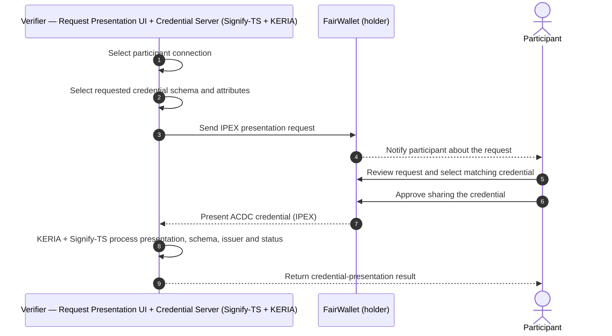

# Credential Verification Flow

**Acceptance criterion 7 (supporting):** Publish schematics of the credential model
(verification side).

> **Status:** 🟡 **Provided — awaiting review.** The sequence below reflects the confirmed
> verification steps supplied by the project team. Presentation uses the **IPEX** protocol and
> is processed by **KERIA + Signify-TS**.

## Verification sequence (confirmed)

## Step descriptions (confirmed)

1. The verifier selects the participant connection.
2. The verifier selects the requested credential schema and attributes.
3. The Credential Server sends an IPEX presentation request.
4. FairWallet notifies the participant about the request.
5. The participant reviews the request and selects a matching credential.
6. The participant approves sharing the credential.
7. FairWallet presents the ACDC credential through IPEX.
8. KERIA and Signify-TS process the presentation, credential schema, issuer and status.
9. The verifier receives the credential-presentation result.

> **Note:** These are the confirmed verification *steps*. Anonymized **evidence** of
> verification (a verifier dashboard plus a documented limitation on full system-side coverage)
> is in [verification-evidence/](../issuance-evidence/verification-evidence/).

## Related

- [System Architecture](system-architecture.md)
- [Credential Issuing Flow](credential-issuing-flow.md)
