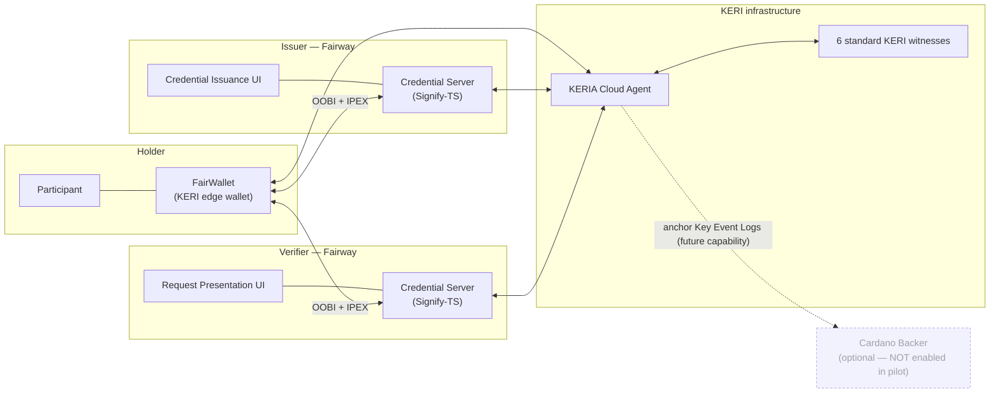

# System Architecture

**Acceptance criterion 7 (supporting):** Publish schematics of the credential model.

> **Status:** 🟡 **Provided — awaiting review.** The architecture below reflects the technical
> implementation confirmed by the project team. Placeholder labels have been replaced with the
> confirmed components.

## Confirmed architecture (pilot deployment)

FairWallet's pilot is built on **KERI** (Key Event Receipt Infrastructure) and issues
**ToIP ACDC** credentials. Identifiers are **KERI Autonomic Identifiers (AIDs)** — not W3C
DIDs. Credential exchange uses the **IPEX** protocol; connections are bootstrapped with
**OOBIs**.

> The dashed **Cardano Backer** node is a supported-but-unused capability (see below).

## Use of Cardano in the pilot

Stated plainly for reviewers, exactly as confirmed by the project team:

- **Cardano was not directly used** in the deployed pilot environment.
- The pilot ran **KERIA with six standard KERI witnesses**. No Cardano Backer, Cardano node,
  or Ogmios service was running.
- **No credentials, personal information, or credential hashes were stored on Cardano** during
  the pilot.
- The Veridian architecture **supports optional Cardano Backer integration** for anchoring
  KERI Key Event Receipt Logs, but this was **not enabled** in the pilot. Network: not
  applicable.

## Components

| Component | Responsibility | Technology |
|-----------|----------------|------------|
| FairWallet | Holder edge wallet; creates the participant AID, receives/holds/presents credentials | KERI edge wallet (Signify) |
| Credential Issuance UI | Issuer operator interface for selecting connections, schemas and attributes | Fairway |
| Credential Server (issuer/verifier) | Creates and signs ACDCs; drives IPEX issuance and presentation | Custom (Signify-TS) |
| Request Presentation UI | Verifier operator interface for requesting presentations | Fairway |
| KERIA Cloud Agent | Cloud KERI agent backing wallet, issuer and verifier | KERIA |
| KERI witnesses (×6) | Receipt and availability of key events (Key Event Logs) | Standard KERI witnesses |
| Cardano Backer | Optional anchoring of Key Event Logs — **not enabled in pilot** | Cardano (future) |

## Related diagrams

- [Credential Issuing Flow](credential-issuing-flow.md)
- [Credential Verification Flow](credential-verification-flow.md)
